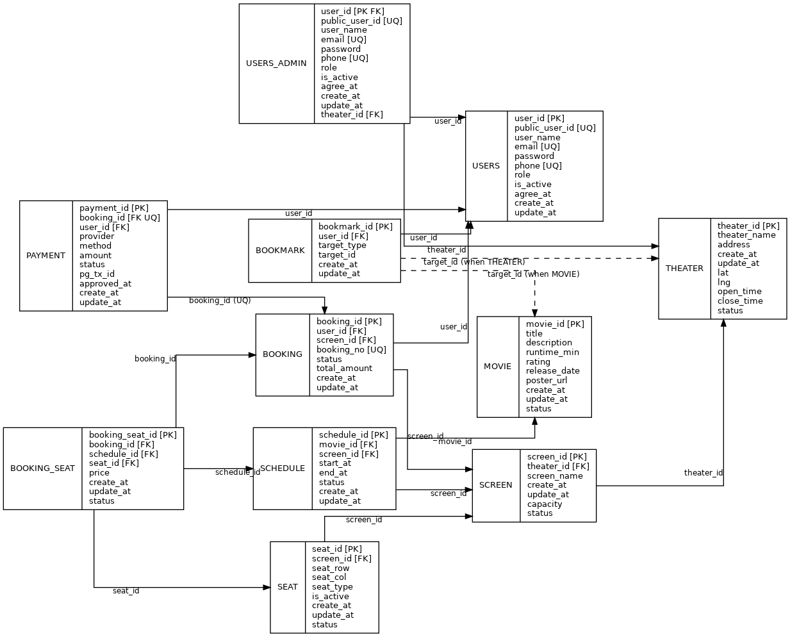

# 🎬 Movieing – 영화 예매 서비스

Movieing은 실제 영화관 예매 흐름을 분석하여 설계한 개인 프로젝트입니다.  
영화 → 상영 일정 → 좌석 → 예매 → 결제까지의 도메인을 직접 모델링하고,  
**상태 기반 설계와 트랜잭션 관리**에 중점을 두어 구현했습니다.

단순 CRUD 구현이 아닌,  
예매/결제 과정에서 발생할 수 있는 **데이터 정합성 문제와 예외 상황**을 고려하여  
실제 서비스에 가까운 구조를 목표로 개발했습니다.

---

## 📁 프로젝트 구조

```text
movieing/
 ├ backend/        # Spring Boot (Java 21)
 ├ frontend/       # React + TypeScript
 ├ docs/           # ERD, Architecture, Diagrams
 └ README.md
```

---


## 🛠 기술 스택

### Backend
- Java 21  
- Spring Boot 3  
- Spring Data JPA  
- Gradle  
- MariaDB  

### Frontend
- React  
- TypeScript  

---

## 🧩 시스템 아키텍처

React 기반의 클라이언트는 REST API를 통해 Spring Boot 서버와 통신합니다.  
서버는 JPA / Hibernate를 사용해 도메인 모델 중심으로 데이터를 처리하며,  
모든 예매 및 결제 로직은 트랜잭션 단위로 관리됩니다.

---

## 🗄 DB 설계 (ERD)

영화 예매 흐름을 기준으로 도메인을 분리하여 데이터베이스를 설계했습니다.

- 영화(MOVIE)는 여러 상영 스케줄(SCHEDULE)을 가질 수 있습니다.
- 상영관(SCREEN)은 하나의 영화관(THEATER)에 속합니다.
- 예매(BOOKING)는 사용자(USERS) 기준으로 생성되며 여러 좌석을 포함할 수 있습니다.
- 결제(PAYMENT)는 예매 단위로 관리되며, 하나의 예매에는 하나의 결제만 존재합니다.
- 모든 주요 테이블은 상태(status) 기반으로 관리하여 데이터 삭제 없이 이력 추적이 가능합니다.

좌석 중복 예매를 방지하기 위해 다음과 같은 제약을 적용했습니다.

- 좌석은 `(screen_id, seat_row, seat_col)` 기준으로 유니크 제약
- 예매 좌석은 `(schedule_id, seat_id)` 기준으로 중복 차단

---

## 🔁 예매 · 결제 트랜잭션 흐름


예매와 결제는 하나의 트랜잭션 흐름으로 관리됩니다.

1. 사용자가 예매 요청 시 `BOOKING(PENDING)` 생성  
2. 좌석은 `BOOKING_SEAT(HELD)` 상태로 점유  

### 결제 성공 시
- `PAYMENT → PAID`
- `BOOKING → CONFIRMED`
- 좌석 상태 → `BOOKED`

### 결제 실패 또는 취소 시
- 전체 트랜잭션 롤백
- 좌석 해제
- 예매 상태 변경 (`CANCELED / FAILED`)

이를 통해 예매 및 결제 과정에서의 데이터 정합성을 보장합니다.

---

## ⭐ 핵심 설계 포인트

- 상태 기반 설계를 통한 예매 / 좌석 / 결제 이력 관리
- 트랜잭션 단위 처리로 데이터 정합성 보장
- DB 제약조건(UNIQUE, FK)을 활용한 중복 예매 방지
- 도메인 중심 설계를 통한 유지보수성과 확장성 고려

---

## 🧠 트러블슈팅

### 좌석 중복 예매 문제
- 동일한 상영 스케줄에 대해 같은 좌석이 여러 번 예매되는 문제 발생 가능
- `(schedule_id, seat_id)` 유니크 제약 조건 적용
- 좌석 상태를 `HELD → BOOKED` 흐름으로 관리하여 동시성 문제 방지

---

## ▶ 실행 방법

### Backend 실행
```bash
cd backend
./gradlew bootRun
